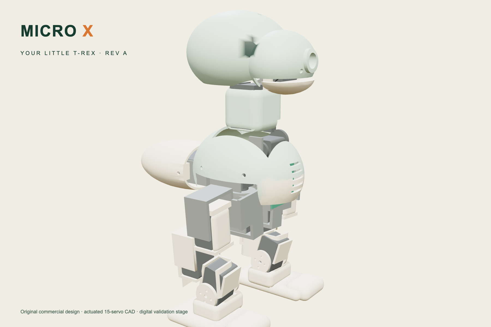

# MICRO X — Rev A

**소유자 hwkim3330이 제작·판매를 목표로 개발하는 상업용 독자 설계 치비 티렉스 로봇.** Microduck의 14축 정책 인터페이스(61 관측 → 14 행동, 50 Hz)를 그대로 쓰지만 기구·외장·서보 배치·전장 자리는 새로 설계했습니다. 비상업 호환 시험기 [Micro Rex](https://github.com/hwkim3330/micro-rex)는 별도 저장소로 보존합니다.

[](https://hwkim3330.github.io/micro-x/web/)

[제품 페이지 · 3D 뷰어](https://hwkim3330.github.io/micro-x/web/) · [학습 Lab](https://hwkim3330.github.io/micro-x/web/lab.html) · [보행 실험](https://hwkim3330.github.io/micro-x/web/simulator.html) · [설계 설명](docs/DESIGN_REVA.md) · [목표와 진행 기준](PROJECT_GOAL.md)

**현재 단계: Rev A 구동 설계 · 디지털 검증.** 출력·조립·보행·내구의 실물 검증은 아직 없으며, 판매 가능 완제품이 아닙니다.

## Rev A에서 바뀐 것

| | P0 (이전) | Rev A |
|---|---|---|
| 기구 | 다리 고정 외형 모델 14부품 | **15서보 구동 기구**: 브래킷·컵·클레비스 판, 배터리 트레이, 보드 벽, 카메라 벽 포함 20개 출력 부품 |
| 외형 | 긴 주둥이, 판형 다리 | **치비 비율 + 단순 외장**: 머리 100×82×74 mm, 닫힌 알 몸통, 목 슬리브, 둥근 종아리 쉘, 82×48 mm 발. 눈·손·발톱 부품 없음(카메라 링이 눈) |
| 동역학 모델 | 원시 도형 + 가정 질량 | **CAD 메시에서 계산한 링크별 질량·관성** (`cad/compat_model.py`) |
| 검증 | 기본 자세 겹침만 | 기본 자세 겹침 0 + **관절 15개 가동 샘플 충돌 0** |
| 웹 | 부품 뷰어 + 1축 턱 학습 | 관절 조작·보행 기록 재생 뷰어, **14축 학습 스튜디오**(학습·평가·비교·ONNX), 실제 CAD 위에서 도는 시뮬레이터 |

## 숫자로 보는 Rev A

| 항목 | 값 | 출처 |
|---|---|---|
| 출력 부품 | 20개, 422 g (PLA 꽉 찬 기준; 실제 인필은 더 가벼움) | `artifacts/parts.json` |
| 구매품 | 서보 15 × 18 g, 배터리 100 g, 보드 30 g, 카메라 4 g = 404 g | 카탈로그 질량 |
| 모델 총질량 | 825 g (Microduck 780 g) | `artifacts/balance.json` |
| HOME 정적 여유 | 무게중심이 발바닥 지지영역 안 30.6 mm | `artifacts/balance.json` |
| 간섭 | 정적 겹침 0 / 관절별 가동 샘플 충돌 0 (1 mm³ 기준) | `artifacts/interference.json` |
| 공식 가중치 시험 | 15회 모두 10초 직립, 속도·방향 기준 통과 6회(정지·서기). 전진 0.3 m/s 명령에 0.11 m/s와 요 드리프트 | `artifacts/compat_evaluation.json` |
| 원가 계산기 기본값 | 15 × $27.49 + $110 + $45, 수율 95 % ≈ $597 (소매가 기준, 견적 아님) | `docs/COST.md` |

전진 명령 추종 미달은 원본 Microduck 모델에서도 같은 하네스로 나타나는 현상이며([Micro Rex 비교](https://github.com/hwkim3330/micro-rex)), X 기구만의 결함으로 해석하지 않습니다. 보행 합격 기준과 학습 계획은 [COMPATIBILITY.md](docs/COMPATIBILITY.md)에 있습니다.

## 설계 개요

- **관절**: 좌우 고관절 요·롤·피치, 무릎, 발목(10) + 목 피치, 머리 피치·요·롤(4) + 턱(1). 피벗·축은 `engineering/functional_interface.json`.
- **서보 배치 규칙**: 몸체는 한 링크의 포켓에, 혼·아이들러 판 두 장은 이웃 링크에. 모든 관절 양단 지지. XL330급 인터페이스 치수와 발주 전 확인 항목은 `engineering/actuator_interface.json`.
- **패키징**: 배터리(NP-F550급)는 꼬리 커버 안 트레이, 컴퓨트 보드는 가슴 그릴 뒤 세워 장착, 카메라는 주둥이 안 카메라 벽. 외장 7개(몸통·목 슬리브·두개골·부리·꼬리 커버·발 2)만 보이고 나머지는 프레임.
- **가동 범위(Rev A 기구 한계)**: 고관절 롤 HOME ±10°, 목 피치 뒤로 -0.2 rad, 머리 롤 ±12°, 턱 0.35 rad. 이 범위 밖은 시뮬레이션 관절 한계로 막습니다.
- 자세한 원칙·남은 일: [DESIGN_REVA.md](docs/DESIGN_REVA.md) · 조립 순서: [ASSEMBLY.md](docs/ASSEMBLY.md)

## 재생성

```sh
uv venv --python 3.11 .venv && uv pip install --python .venv/bin/python -r requirements.txt
.venv/bin/python cad/build.py            # 20 STEP/STL + GLB 리그 + parts.json
.venv/bin/python cad/compat_model.py     # models/micro_x_14.xml, models/rig.json
.venv/bin/python tools/interference.py   # 정적 + 관절 가동 샘플 간섭
.venv/bin/python tools/balance.py
.venv/bin/python tools/documents.py      # drawings.pdf, bom.csv
.venv/bin/python tools/validate.py && .venv/bin/python -m unittest discover -s tests

uv venv --python 3.12 .venv-policy && uv pip install --python .venv-policy/bin/python -r requirements-policy.txt
.venv-policy/bin/python tools/fetch_compat.py
.venv-policy/bin/python tools/evaluate_compat.py --seconds 10 --seeds 3
.venv-policy/bin/python runtime/training_service.py   # Lab 학습·평가·시뮬레이터 http://127.0.0.1:5201/web/lab.html

npm ci && node --test tests/learning.test.mjs
CHROME_PATH=/path/to/chrome node tools/test-web.mjs && node tools/test-lab.mjs && node tools/test-simulator.mjs && node tools/test-compat-web.mjs
```

## 권리와 판매 방향

원본 기구·CAD 생성 소스·모델·도면은 소유자 권리를 유보합니다(소유자의 상업 이용을 제한하는 비상업 라이선스가 아닙니다). 웹·도구 코드는 MIT, Three.js는 MIT. 공식 추론 코드·가중치(Apache-2.0)는 저장소에 재배포하지 않고 로컬 캐시에만 내려받습니다. 상세: [LICENSE](LICENSE) · [THIRD_PARTY.md](THIRD_PARTY.md) · [PROVENANCE.md](docs/PROVENANCE.md). 제품명·디자인 권리 검토와 공급자 견적은 출시 전 별도 게이트입니다.
