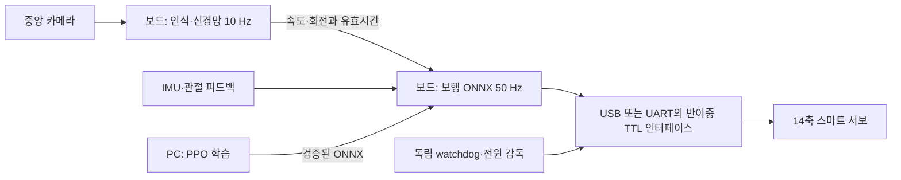

# X의 실제 실행 보드

소형화와 원본 실행 환경 재현을 우선해 **Radxa Zero 3W 4GB**를 첫 실물 검증 후보로 정합니다. 2GB는 동시 부하 시험 후 원가 절감 후보이며, Pi 5/CM5는 연산 여유가 부족할 때 비교할 대안입니다. 아직 실제 보드에서 측정하지 않았습니다.

[공식 Microduck 설치 문서](https://github.com/pollen-robotics/microduck/blob/6507d2e960417aaa4ecd38eccf59b2dcf586ecd2/docs/robot/install-dev.md)는 Radxa Zero 3와 Armbian을 지정합니다. 원본 재현용 보드로는 이 구성을 유지합니다. [Radxa 사양](https://docs.radxa.com/en/zero/zero3)은 RK3566 Cortex-A55, 65×30 mm입니다. Radxa에서 현재 X의 Pi 카메라 드라이버가 그대로 작동한다고 가정하지 않습니다.

[CM5](https://www.raspberrypi.com/products/compute-module-5/)는 Cortex-A76 기반이며 모듈 크기 55×40×4.7 mm입니다. 이 치수는 캐리어·냉각·커넥터를 제외합니다. 제조사는 최소 2036년 1월까지 생산을 명시합니다. 실제 구매가는 구성·유통·시점에 따라 확인해야 하므로 현재 BOM에 확정 가격을 넣지 않습니다. [Pi 5](https://www.raspberrypi.com/products/raspberry-pi-5/)는 기존 Camera Module 3 경로를 비교할 대안입니다. CM5의 캐리어와 카메라 FFC 연결은 별도 설계해야 합니다.

## 무엇을 어디서 실행하는가

| 기능 | 실행 위치 | 목표 및 상태 |
|---|---|---|
| 보행 ONNX, IMU 자세·관절 입력, 모터 목표 | 로봇의 Linux 보드 | 50 Hz / 20 ms 주기. 실물 I/O 미구현·미검증 |
| 전체 초파리 연결망과 행동 선택 | 같은 보드의 별도 프로세스 | 10 Hz 목표. 지연되어도 보행 프로세스를 막지 않도록 IPC 분리 예정 |
| 중앙 카메라 1개, 영상·표정·음성 I/O | 같은 보드 | 보행과 동시에 부하·발열 검증 필요. 대형 음성 모델은 기본 탑재 가정 없음 |
| 모터 내부 위치·전류 제어 | 각 스마트 서보의 펌웨어 | 신경망 출력을 직접 PWM으로 연결하지 않음 |
| 전원 감시·watchdog | 별도 소형 감독 MCU/회로 후보 | 칩과 펌웨어 미선정. Linux 정지 시 모터를 관리하는 경로 필요 |
| PPO 학습·대량 MuJoCo/Warp 시뮬레이션 | RTX 3090 개발 PC | 현재 실제 실행한 경로. 학습 결과 ONNX만 보드로 이전 |
| 웹 3D 화면 | 휴대폰/PC 브라우저 | 공개 Pages는 정적 화면. 로봇 보드에서 3D 렌더링할 필요 없음 |



초기 배선은 Pi의 USB → 호환 DYNAMIXEL TTL 어댑터 → 서보 버스를 검토합니다. GPIO의 일반 UART 선을 반이중 버스에 바로 연결하는 구성으로 확정하지 않습니다. IMU는 SPI/I²C 후보이며 축 정렬·타임스탬프·샘플 지연을 정책 입력과 맞춰야 합니다. 제품 캐리어에는 이 버스 인터페이스와 전원 감독을 통합할 예정이나 회로도/PCB는 아직 없습니다. 부팅 기본 상태는 모터 비활성으로 설계하고, 오래된 행동 명령은 정지 명령으로 바꾸되 실제 넘어짐 상황의 처리는 로봇 검증 후 정합니다.

## 전압 가정부터 바로잡기

[ROBOTIS XL330-M288-T](https://emanual.robotis.com/docs/en/dxl/x/xl330-m288/)는 **3.7–6.0 V, 권장 5.0 V**입니다. 현재 BAM 비교의 7.4 V는 원본 실행 조건을 재현한 시뮬레이션 설정이며 실물 XL330 전원으로 채택하지 않습니다. 2S 배터리를 이 모터에 직결하는 배선도 만들지 않습니다. 모터용 안정화 전원과 보드용 전원을 분리하고 공통 기준 접지·순간 전류·배선·회생/과도 전압을 실제 부품으로 검증해야 합니다. 정격 5 V에서의 모터 모델과 보행 성능 재검증이 필요합니다. 현재 보고서를 실제 하드웨어 호환성의 합격 근거로 쓰지 않습니다.

## 직접 측정한 것과 남은 합격 조건

`tools/benchmark_brain.mjs`로 전체 139,255 뉴런, 2,698,236 연결을 CPU에서 실행했습니다. i7-10700K 호스트에서 30회 준비 후 300회 측정한 10틱 묶음은 p95 약 17.36 ms, p99 약 20.23 ms, 프로세스 최대 RSS 약 197 MiB였습니다. [원시 결과](../artifacts/brain_host_benchmark.json). 화면·카메라·실물 I/O를 포함하지 않은 호스트 측정이며 Pi 성능으로 환산하지 않습니다.

실제 보드에서 Node.js를 설치하고 별도 보관한 고정 Microfly 소스로 같은 명령을 실행합니다. 스크립트가 소스·그래프 SHA-256을 확인합니다.

```sh
node tools/benchmark_brain.mjs /path/to/microfly-reference board-brain-result.json
```

보드 선정의 다음 조건은 30분 이상 카메라·보행·신경망 동시 실행에서 20 ms 보행 주기 지연 분포, 100 ms 신경망 주기, RSS, CPU 온도·클럭 저하·소비전력·저전압을 기록하는 것입니다. 신경망 부하가 보행 주기를 침범하면 먼저 PC로 행동 계산을 분리하여 시험하고, 기체에는 검증된 보행을 남깁니다. 현재 연결된 실물 보드가 없어 ARM 측정, 실제 모터 동작, 최종 배터리 시간은 아직 검증하지 못했습니다.

## 이번 X 보행 진단

[25회 접촉 민감도 시험](../artifacts/contact_sensitivity.json)은 시드 10, 각 10초, 정지/전진 0.1·0.3 m/s/좌우 회전 0.3 rad/s를 비교했습니다. 기본 모델, 마찰 0.8, 좁은 발, 짧은 발, 발 외 접촉 제거 모두 이동 명령 추종 기준을 통과하지 못했습니다. 발 외 접촉을 없애도 기본 결과가 같았고, 기본 전진 시험에서 침투 접촉은 양발과 바닥만 기록됐습니다. 따라서 이 시험에서는 몸체 충돌이 정체의 원인이라는 근거가 없습니다. 물리 접촉을 제거한 후보는 진단용으로만 남기고 기본 모델을 변경하지 않았습니다. 질량·관성·실제 모터 전압을 반영한 후 재학습/검증해야 합니다.


## 보행 모델 크기와 보드 검사

고정된 공식 보행 ONNX는 **793,705 bytes**입니다. 호스트에서 CPU 한 스레드로 100회 준비 후 2,000회 추론한 p95는 **0.043 ms**, 전체 Python/ONNX 프로세스 최대 RSS는 **약 70 MiB**였습니다. [측정 결과](../artifacts/policy_host_benchmark.json). 앞의 신경망 약 197 MiB와 별도 프로세스·별도 시험이며 OS, 카메라 버퍼, 동시 부하를 포함하지 않습니다. 따라서 4GB 선정은 측정 완료된 최소 요구량이 아니라 개발 여유를 둔 후보입니다.

보드에서는 MuJoCo·PyTorch 없이 별도 가상환경의 NumPy와 ONNX Runtime CPU만으로 검사할 수 있습니다. 다음 설치는 ARM 보드에서 아직 실행하지 않았으며 wheel/OS 호환성 확인이 필요합니다. 위 고정 모델을 준비한 후 실행합니다. 모델 파일의 SHA-256이 다르면 검사가 거절됩니다.

```sh
python3 -m venv .venv-board
.venv-board/bin/pip install numpy onnxruntime==1.24.1
.venv-board/bin/python tools/benchmark_policy.py --model /path/to/alpha_walking.onnx --output board-policy-result.json
node tools/benchmark_brain.mjs /path/to/microfly-reference board-brain-result.json
```

이 검사는 모델 추론만 측정합니다. 모터를 연결하거나 구동하지 않으며 센서 입력은 합성 값입니다. 보행 모델의 작은 메모리 요구와 X 몸체에서 잘 걷는지는 별도 문제입니다. 실제 보드의 카메라·IMU·버스 통합과 30분 동시 부하 검사가 끝나야 최종 부품과 RAM 용량을 확정합니다.
